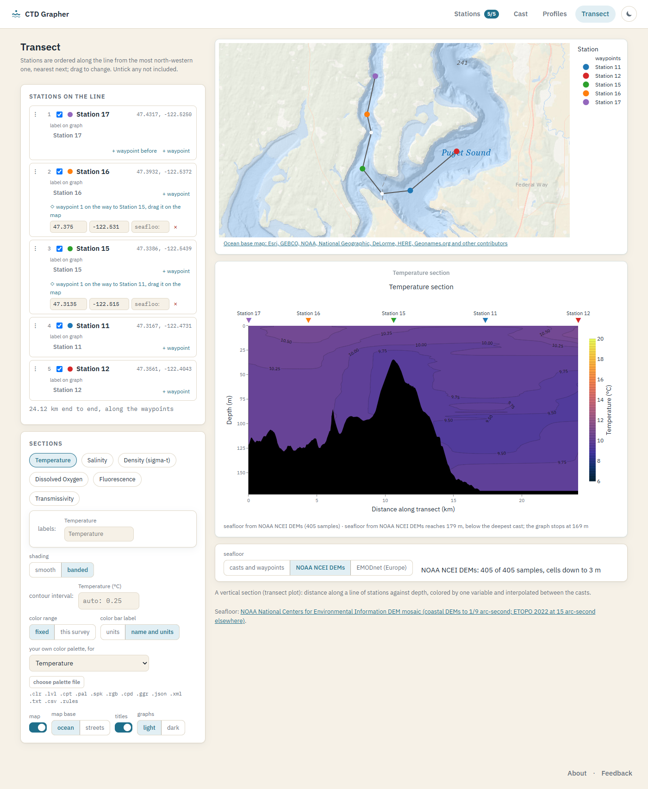
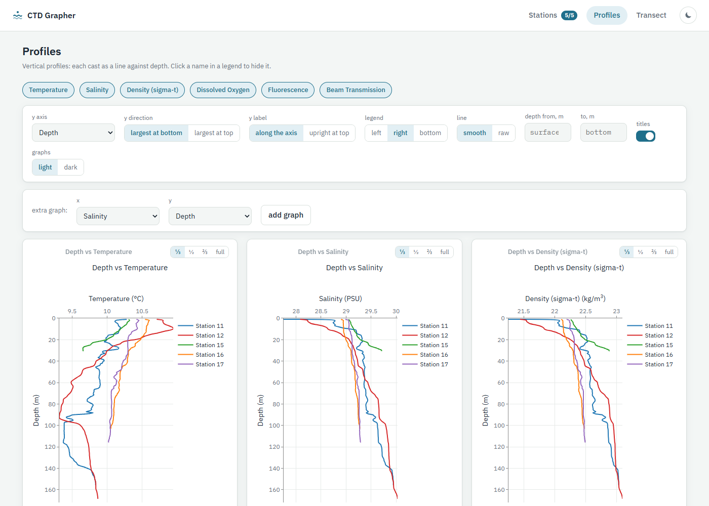

# CTD Grapher

Depth profiles and transect sections from Sea-Bird `.cnv` CTD casts, in the browser. Nothing to install; files never leave your computer.

**Use it:** https://jimothy-dev.github.io/CTD_Grapher_Web/

[](https://doi.org/10.5281/zenodo.22371639)



- **Stations** — drop in any number of `.cnv` files, or OpenCTD `.csv` logs (depth, salinity and sigma-t are derived from the raw pressure, temperature and conductivity the way OpenCTD's own template does), or load the example casts. Names come from the filenames and can be edited. Switch stations in and out of the active set; both tools graph the active ones. Positions are read from the header or from latitude/longitude columns, or typed in any usual format.
- **Profiles** — one graph per variable, active stations overlaid, depth down the page; or any variable or channel in the files against any other (a second oxygen unit, potential temperature, a raw voltage). Legend position, titles, graphs per row, grid lines, light or dark graphs, PNG download.
- **Transect** — stations are ordered along the line automatically (from the most north-western one, nearest next) or by dragging; label them, and drag waypoints on the map so the line follows the water rather than crossing land, or carries on before the first station and beyond the last. The seafloor comes from the casts and the depths you give waypoints, or is read along the routed line from NOAA NCEI's DEM mosaic (worldwide) or EMODnet Bathymetry (Europe). Between stations the field follows a shape-preserving curve through the casts at every depth. Station map on an ocean base map with depth shading (or streets); one section per variable with fixed color ranges so a color always means the same value, or your own palette file (Surfer `.clr`/`.lvl`, GMT `.cpt`, ODV `.pal`, and more; a file with real values sets the range, a normalised one only the colors).
- **Feedback** — a page that files your suggestion or issue here on GitHub (a free GitHub account is needed) and lists what others have sent.



Uploads and settings stay in the browser tab, including across a reload, and are gone when the tab closes.

The same graphs as a Colab notebook: [CTD_Grapher_v2](https://github.com/jimothy-dev/CTD_Grapher_v2).

## Known limits

- Sea-Bird `.cnv` and OpenCTD `.csv` only. Process Sea-Bird casts in Sea-Bird software first: no sensor corrections are applied here, and a raw cast is only trimmed to its downcast for display. OpenCTD depth assumes 45° latitude and takes the lowest pressure reading as the surface when the logger saw air (else standard atmosphere); salinity is PSS-78 from the EZO conductivity, so it is only as good as that probe's calibration.
- On a section everything between stations is interpolated: a shape-preserving curve through the casts at every depth, which never goes outside the two casts on either side. It is not a measurement.
- Casts are checked against usual ranges (salinity 0 to 60, temperature -3 to 45 °C, and so on) and flagged when they fall outside; nothing is corrected.
- The "NOAA NCEI DEMs" and "EMODnet" seafloor options read public depth maps along your line (NOAA worldwide, EMODnet for European seas). Where a cast reached deeper than the map says, the cast wins. EMODnet measures depth from low tide and your casts from that day's sea surface, so its seafloor can sit a metre or two off.
- Fixed color ranges are chosen for Puget Sound and temperate estuaries; switch to "this survey" or load a palette elsewhere.
- Two instruments may log the same variable in different units (oxygen in mg/L and mL/L, say). The shared channel is preferred, and a remaining mismatch is flagged under the graph rather than converted.
- Tested on the example casts and on 20 public files from SBE 9, 19, 19plus, 25, 25plus and 37 instruments. Send a `.cnv` that does not load.
- Palette readers were checked against real files for GMT, Ferret, NCL, ODV, ncWMS, SNAP, GIMP, ParaView, QGIS and GRASS, but only against documented examples for Surfer `.clr`/`.lvl` and ESRI `.clr`. The note under a loaded palette says what was read, so a misread shows; a file that cannot be read is refused and the colours stay as they were.

## Develop

```
npm install
npm run dev
npm run build
```

React, TypeScript, Vite, Plotly.js. Deployed to GitHub Pages by the workflow in `.github/workflows/`. Public sample casts for testing are in `public/samples/` with their sources.

**Feedback inbox.** The Feedback page posts to a form endpoint when one is configured, so people can write without signing in and the message arrives by email. Create a free form (Formspree gives a form URL; Web3Forms gives an access key), then in the repository's Settings → Secrets and variables → Actions → Variables set `VITE_FEEDBACK_ENDPOINT` to the URL (`https://formspree.io/f/…`, or `https://api.web3forms.com/submit` with `VITE_FEEDBACK_KEY` set to the key) and re-run the deploy. Without them the page falls back to opening a prefilled GitHub issue.

## Cite

Simpson, J. (2026). CTD Grapher (v1.0.0). Zenodo. https://doi.org/10.5281/zenodo.22371642

The DOI https://doi.org/10.5281/zenodo.22371639 always points at the latest version. Details in `CITATION.cff`, or use the "Cite this repository" button above.

Licence GPL-3.0. Example casts collected by students of TGEOS 445, Estuarine Field Studies, University of Washington Tacoma, May 2026.
